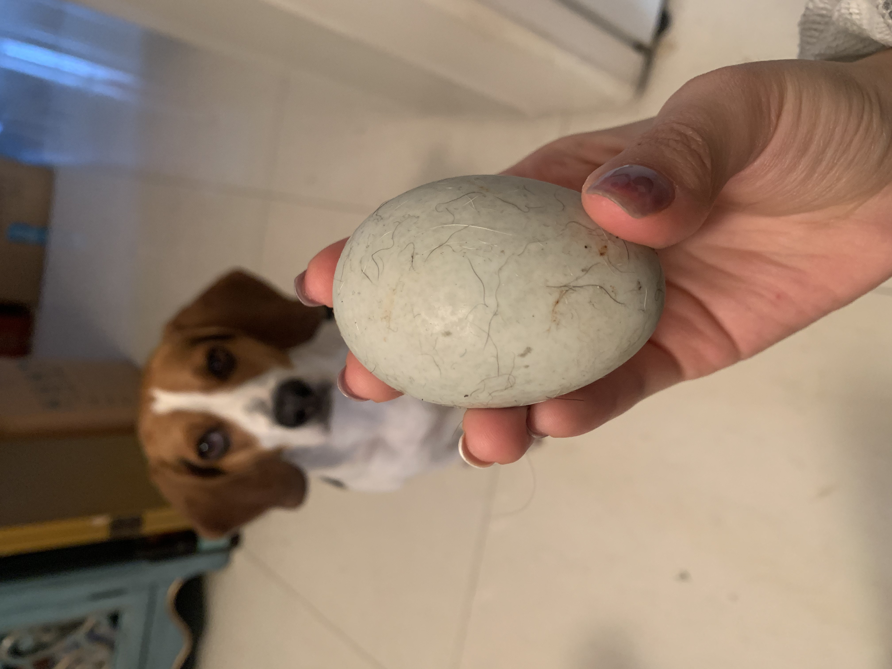

# This is Jeff's awesome website

This gif is found online

I can link to useful things like [google](https://www.google.com/) and [p8105](https://www.p8105.com.)

I can make an extra page on my site and link to that, here's my [about](about.html). 

This "about" website is in our directory, so don't have to go online to look for sites, can just use the html link

## Adding pictures to the web. 

Here's my cutie egg thief caught in action: 

this image is from the local directory.
the following image is an example of changing the width

## Adding text file in the directory
This _site.yml text file gives a navigation bar on the website 
